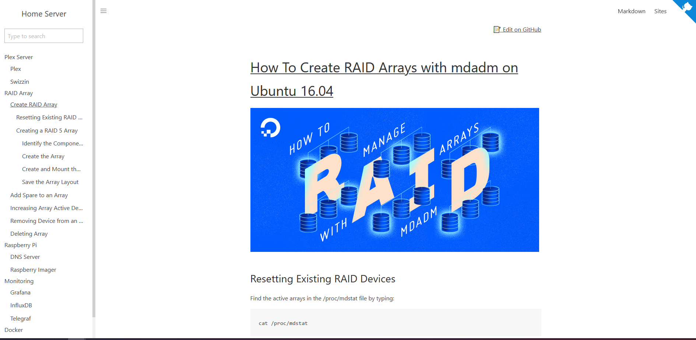

<div align="center">
<h1>Home Lab Docsify</h1>
<image src="https://github.com/phamumb/home-lab-docsify/actions/workflows/pages/pages-build-deployment/badge.svg">
</div>


## Live
- [Home Lab Docsify](https://docs.luatpham.com)
## What is this
---
- Showing all documentation for home's lab and things that related to server. 
- Reducing time for looking up for tips/guideline on the internet. 
- Hosting in-house server for documentation center.

## Installation 
```console 
npm install docsify-cli -g
```
## Usage
Run following command to bring up the app:
```console 
docsify serve docs
```
The app will be served using port `localhost:3000`


