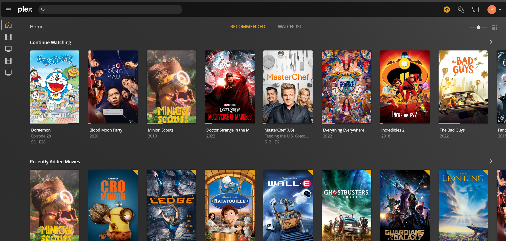

# Plex Media Server


## Prerequisites
- [Ubuntu 20.04 OS](https://ubuntu.com/download/server)
- [Docker Engine & Docker Compose](docker/install-docker.md)
- [Docker NVIDIA container](docker/nvidia-container.md)
- [RAID Array Level 5](raid-array/create-raid-array.md)
- [PURE VPN](https://purevpn.com)

## Commands
`id <USER>` - Showing all information about the user
`lsblk -l`  - Showing devices and mount points
`chmod 777 <FOLDER_NAME>` - Change permission for a folder

## Download Clients
### **SABNzbd**
Sabnzbd makes Usenet as simple and streamlined as possible by automating everything we can. All you have to do is add an .nzb. SABnzbd takes over from there, where it will be automatically downloaded, verified, repaired, extracted and filed away with zero human interaction.
- **Download folders**
In Sabnzbd gui settings, under Folders, make sure to set the Completed Download Folder as /downloads and the Temporary Download Folder as /incomplete-downloads
We have set /incomplete-downloads and /downloads as optional paths, this is because it is the easiest way to get started. While easy to use, it has some drawbacks. Mainly losing the ability to hardlink (TL;DR a way for a file to exist in multiple places on the same file system while only consuming one file worth of space), or atomic move (TL;DR instant file moves, rather than copy+delete) files while processing content.
Use the optional paths if you dont understand, or dont want hardlinks/atomic moves.
The folks over at servarr.com wrote a good write-up on how to get started with this.
- **Usage**
To help you get started creating a container from this image you can either use docker-compose or the docker cli.

```docker-compose
---
version: "2.1"
services:
  sabnzbd:
    image: lscr.io/linuxserver/sabnzbd:latest
    container_name: sabnzbd
    network_mode: host
    environment:
      - PUID=1000
      - PGID=1000
      - TZ=America/Newyork
    volumes:
      - /path/to/data:/config
      - /path/to/downloads:/downloads #optional
      - /path/to/incomplete/downloads:/incomplete-downloads #optional
    restart: unless-stopped
```

### **Transmission**
- **VPN Services**: [List of supported VPN](http://haugene.github.io/docker-transmission-openvpn/supported-providers/)
- **Usage**
  - Create/Copy config file:
  ```
  OPENVPN_PROVIDER=<VPN_PROVIDER>
  OPENVPN_CONFIG=<VPN_SERVER_NAME>
  OPENVPN_USERNAME=<VPN_USERNAME>
  OPENVPN_PASSWORD=<VPN_PASSWORD>
  ```
  - Dockercompose file
  ```
  version: '2.1'
  services:
    transmission:
        image: haugene/transmission-openvpn
        container_name: transmission
        network_mode: host
        volumes:
            - /config/transmission:/config
            - ${PLEX_PATH}/data/downloads/complete:/downloads
        env_file:
            - ./config.env
        environment:
            - PUID=0
            - PGID=0
            - CREATE_TUN_DEVICE=true
            - WEBPROXY_ENABLED=false
            - TRANSMISSION_DOWNLOAD_DIR=/downloads
            - TRANSMISSION_IDLE_SEEDING_LIMIT_ENABLED=true
            - TRANSMISSION_SEED_QUEUE_ENABLED=true
            - TRANSMISSION_INCOMPLETE_DIR_ENABLED=false
            - LOCAL_NETWORK=192.168.0.0/16
        cap_add:
            - NET_ADMIN
        logging:
            driver: json-file
            options:
                max-size: 10m
        restart: unless-stopped
  ```
  
## Indexers
### **Jackett**
- **Usage**: Docker compose file
    ```
    ---
    version: "2.1"
    services:
      jackett:
        image: lscr.io/linuxserver/jackett:latest
        container_name: jackett
        network_mode: host
        environment:
          - PUID=1000
          - PGID=1000
          - TZ=America/Newyork
          - AUTO_UPDATE=true #optional
        volumes:
          - <path to data>:/config
          - <path to blackhole>:/downloads
        restart: unless-stopped
    ```

### **NZBGeek**
- **Usage**
  - Go to this site: [nzbgeek](https://nzbgeek.info/)
  - Login with your credential
  - NZBGeek host: https://api.nzbgeek.info/
  - Click on the corner to get api key: `<username>` --> `my account`


### **NZBPlanet**
- **Usage**
  - Go to this site: [nzbgeek](https://nzbplanet.net/)
  - Login with your credential
  - NZBPlanet host: https://api.nzbplanet.net
  - Click on the corner to get api key: `<username>` --> `my account`

## Services
### **Radarr**
### **Sonarr**
### **Bazarr**

## Requesting
### **Overseerr**